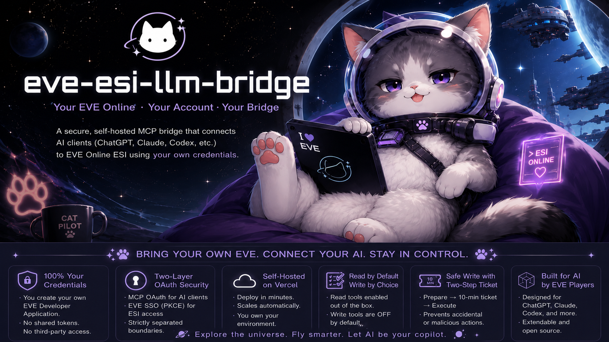

<p align="center">
  
</p>

# EVE ESI LLM Bridge

**BYO credentials. Self-hosted remote MCP. Separated OAuth boundaries. Built for ChatGPT, Claude, Codex, and other MCP clients.**

Each operator uses their own EVE account, EVE Developer Application, and deployment. MCP client OAuth and EVE SSO remain separate trust boundaries, so EVE credentials are not shared or treated as generic MCP credentials.

[日本語 README](README.ja.md)

> This project contains no shared EVE credentials, no pre-authorized character, no private gateway key, and no dependency on another person's EVE application. Every installation is independently authorized by its operator.

## What this gives you

After deployment and EVE SSO authorization, an MCP client can use tools that:

- read current private ESI state for the character that signed in;
- read official public ESI data such as universe, market, routing, kill/jump and type data;
- resolve EVE names and IDs through official resolver endpoints;
- inspect the ESI OpenAPI document and discover routes compatible with the granted scopes;
- optionally prepare and execute a deliberately small allowlist of ESI write/UI actions.

The bridge is designed for **LLM-assisted research and account-side ESI operations**, not game-client automation. ESI does not expose general combat control, movement execution, module control, scanning, local chat, overview state, or arbitrary inventory manipulation.

## The important idea

There are two separate authorization relationships:

```text
ChatGPT / Claude / Codex
        |
        | MCP OAuth authorization-code + PKCE
        v
Your Vercel deployment
        |
        | EVE SSO OAuth + PKCE
        v
CCP EVE SSO ----> EVE ESI
        |
        `---- only YOUR selected character and granted ESI scopes
```

The outer OAuth layer proves to the MCP server which EVE identity the current LLM connection represents. The inner EVE SSO layer grants ESI access. They are intentionally separate: an EVE access token is never treated as a generic MCP access token.

See [Architecture](docs/ARCHITECTURE.md) for a full walk-through.

## Security properties in this reference

- **No EVE client secret required at runtime.** The EVE authorization leg uses PKCE.
- **No database required for the reference deployment.** OAuth transaction state, dynamic client registration metadata, MCP tokens and action tickets are sealed with AES-256-GCM using your own `MCP_AUTH_SECRET`.
- **Fixed ESI origin.** Tool inputs are paths, not arbitrary URLs, so the bridge is not an SSRF/open-proxy endpoint.
- **Character binding.** `/characters/{character_id}/...` private routes must match the character in the validated EVE JWT.
- **JWT validation.** EVE JWT signature, issuer, audience, expiry and `CHARACTER:EVE:<id>` subject are checked.
- **Least privilege by configuration.** ESI permissions are whatever scopes *you* enable and request.
- **Writes are off by default.** `EVE_ENABLE_WRITE_ACTIONS=false` ships as the default.
- **Two-step writes.** An action is validated and sealed into a 10-minute ticket before a separate execute call revalidates it.
- **Current MCP packages.** The sample requires `mcp-handler >=1.1.0` and MCP TypeScript SDK `>=1.26.0`; older combinations had a published cross-session state vulnerability.

Read [Security model](docs/SECURITY.md) before enabling write actions.

---

# Quick start: from ZIP/repository to a working remote MCP

The path below deliberately uses only accounts and credentials you control.

## 0. Prerequisites

You need:

1. an EVE Online account;
2. access to the [EVE Developers Portal](https://developers.eveonline.com/);
3. a GitHub account or another way to deploy this source to Vercel;
4. a Vercel account;
5. an MCP-capable client.

For **ChatGPT Web**, availability depends on your ChatGPT plan. As of **2026-08-02**, OpenAI documents full custom MCP including write/modify actions for Business, Enterprise and Edu; Pro can connect custom MCP for read/fetch in developer mode. The current public help article does not list Plus as a custom-MCP developer-mode tier. Check the current OpenAI documentation before assuming a particular plan supports this path.

Claude Code supports remote HTTP MCP servers and OAuth. Other clients may differ.

## 1. Put this project in a repository you control

Use either the source tree or the release ZIP. Do not copy another operator's `.env`, Vercel environment, EVE tokens, or OAuth registration.

If you downloaded the ZIP:

```bash
unzip eve-esi-llm-bridge-v0.1.0.zip
cd eve-esi-llm-bridge
```

Create your own Git repository and push it to your own GitHub account if you want Vercel Git deployment.

## 2. Make the first Vercel deployment

Import your repository in the Vercel dashboard. The first build can be deployed before EVE credentials are configured; authentication routes will report configuration errors until the environment variables are added.

Once deployed, record your stable production origin, for example:

```text
https://my-eve-bridge.vercel.app
```

Use the production origin, not a changing preview-deployment URL, for OAuth callbacks.

Detailed instructions: [Vercel deployment](docs/VERCEL-DEPLOY.md).

## 3. Create YOUR EVE Developer Application

In the EVE Developers Portal, create an application for this deployment.

Use this callback URL exactly:

```text
https://YOUR-PRODUCTION-DOMAIN/oauth/eve/callback
```

Choose only the ESI scopes you actually want. A reasonable read-oriented starter is included in `.env.example` and [ESI scopes](docs/ESI-SCOPES.md).

Copy your application's **Client ID**. The PKCE implementation in this repository does not need the EVE client secret.

Detailed instructions: [EVE Developer setup](docs/EVE-DEVELOPER-SETUP.md).

## 4. Generate your deployment encryption secret

If Node.js is installed:

```bash
npm run secret
```

Or open `tools/generate-secret.html` locally in a modern browser and click **Generate 32-byte secret**. The page uses Web Crypto locally and does not transmit the value.

The generated value is your `MCP_AUTH_SECRET`. Treat it like a password. Changing it invalidates outstanding MCP logins and action tickets.

## 5. Configure Vercel environment variables

Set these for Production:

```text
EVE_CLIENT_ID=<your own EVE app client ID>
MCP_AUTH_SECRET=<your own generated 32-byte base64url secret>
PUBLIC_BASE_URL=https://YOUR-PRODUCTION-DOMAIN
EVE_ESI_SCOPES=<space-separated scopes enabled on your EVE app>
EVE_ENABLE_WRITE_ACTIONS=false
MAX_ESI_PAGES=50
MCP_REFRESH_TTL_DAYS=7
```

Recommended for a personal instance:

```text
EVE_ALLOWED_CHARACTER_IDS=<your character ID>
```

When `EVE_ALLOWED_CHARACTER_IDS` is empty, any EVE character can authenticate, but each user still receives only *their own* EVE authorization. Setting an allowlist prevents other EVE users from consuming your personal deployment at all.

Redeploy after changing environment variables.

## 6. Verify the OAuth/MCP discovery endpoints

Open these in a browser:

```text
https://YOUR-PRODUCTION-DOMAIN/
https://YOUR-PRODUCTION-DOMAIN/.well-known/oauth-protected-resource
https://YOUR-PRODUCTION-DOMAIN/.well-known/oauth-authorization-server
```

The MCP endpoint is:

```text
https://YOUR-PRODUCTION-DOMAIN/api/mcp
```

Do **not** paste a refresh token, EVE access token, or `MCP_AUTH_SECRET` into ChatGPT/Claude configuration. The client should discover OAuth and send you through the browser authorization flow.

## 7A. Connect ChatGPT Web

Current OpenAI UI and plan availability can change. The documented flow is:

1. enable developer mode for an eligible account/workspace;
2. open **Settings / Workspace Settings → Apps → Create**;
3. enter the remote MCP endpoint:
   `https://YOUR-PRODUCTION-DOMAIN/api/mcp`;
4. select OAuth/authentication if the UI asks;
5. choose **Scan tools**;
6. when the browser authorization flow appears, sign in to EVE and select the character you want this connection to represent;
7. approve the ESI scopes shown by EVE;
8. finish creating the custom app;
9. start a new chat, enable the app, and ask it to call `eve_status`.

You do **not** need to pre-register ChatGPT's callback URL in the EVE Developer Portal. ChatGPT is an OAuth client of **this bridge**. EVE redirects only to **your bridge's** `/oauth/eve/callback`; the bridge then returns the authorization result to ChatGPT.

See [ChatGPT Web setup](docs/CHATGPT-WEB.md) for plan notes, the exact OAuth roles and diagnostics.

## 7B. Connect Claude Code

```bash
claude mcp add --transport http eve https://YOUR-PRODUCTION-DOMAIN/api/mcp
claude
```

Inside Claude Code:

```text
/mcp
```

Select the EVE MCP server and authenticate. Your browser should open the EVE SSO flow. After it succeeds, try:

```text
Use the EVE tools and show my current connection status.
```

See [Claude and other MCP clients](docs/CLAUDE-AND-OTHER-CLIENTS.md).

## 8. First useful prompts

Read current character state:

```text
Use ESI, not memory. Check my current ship, location, wallet and trained skills, then explain which facts came directly from ESI.
```

Use public ESI before ordinary web research:

```text
Resolve Jita to its system ID, get the official system information and current public system jumps/kills available from ESI, and clearly separate API facts from inference.
```

Inspect what your token can actually do:

```text
Call eve_capabilities and summarize the read capabilities my current ESI scopes expose. Do not assume a scope that is not present.
```

More: [Prompt pack](examples/prompt-pack.md).

---

# Optional write actions

Read-only is the recommended starting point. Write actions require **both**:

1. the corresponding write scopes enabled on your EVE Developer Application and included in `EVE_ESI_SCOPES`; and
2. `EVE_ENABLE_WRITE_ACTIONS=true` in your deployment.

The bridge intentionally does not expose every non-GET ESI operation. The sample allowlist covers selected UI, fitting, contact, mail, calendar and fleet operations. See [Security](docs/SECURITY.md#write-action-boundary) and `src/lib/action-policy.js`.

The MCP tools use a deliberate two-step protocol:

```text
LLM proposes exact ESI method/path/body
          |
          v
eve_prepare_action
  validates allowlist + character binding
          |
          v
10-minute authenticated encrypted ticket
          |
          v
eve_execute_action
  revalidates ticket + current OAuth identity
          |
          v
ESI mutation
```

This is an infrastructure guardrail, not a substitute for user confirmation or good tool descriptions.

# What is stored where?

This reference implementation is intentionally stateless between requests.

| Data | Where it exists | Notes |
|---|---|---|
| EVE Client ID | Vercel environment | Public identifier; belongs to your app |
| EVE client secret | **Not used by this implementation** | PKCE EVE flow |
| `MCP_AUTH_SECRET` | Vercel environment | Private 32-byte encryption key |
| EVE access token | Inside short-lived encrypted MCP access token | Validated before use |
| EVE refresh token | Inside encrypted MCP refresh token | Never returned as plain tool output |
| ChatGPT/Claude OAuth client metadata | Sealed into the DCR-generated `client_id` | No database required |
| Action request | Sealed into 10-minute ticket | Exact method/path/query/body |

For a large public multi-tenant service, replace this compact stateless authorization server with an established identity provider / durable authorization service. OpenAI's current MCP authentication guidance explicitly recommends an established identity provider rather than implementing broad production authentication from scratch.

# Repository map

```text
app/
  api/[transport]/route.js              MCP server
  oauth/authorize/route.js              outer OAuth authorization endpoint
  oauth/token/route.js                  outer OAuth token + refresh endpoint
  oauth/register/route.js               stateless DCR endpoint
  oauth/eve/callback/route.js           EVE SSO callback
  .well-known/...                       OAuth discovery metadata
src/lib/
  eve.js                                EVE SSO/JWT/ESI client
  esi-policy.js                         safe ESI path + character boundary
  oauth.js                              MCP token issuance/refresh/PKCE
  oauth-client.js                       stateless dynamic client registration
  crypto.js                             AES-256-GCM sealing
  action-policy.js                      exact write allowlist
  actions.js                            prepare/execute action tickets
  runtime.js                            environment-driven policy
config/scopes.json                      sample scope profiles
skills/eve-esi-assistant/SKILL.md       model-facing skill starter
examples/prompt-pack.md                 example requests
tools/generate-secret.html              offline secret generator
docs/                                   complete implementation/setup docs
tests/                                  dependency-light policy/crypto tests
```

# Turn this repository into an LLM skill

The code is deliberately tool-oriented. Give an LLM the repository and ask it to produce a skill for its own skill format while preserving the source hierarchy:

```text
Read this repository completely. Build an EVE Online assistant skill around the
MCP tools it exposes. Treat authenticated ESI as the source of truth for current
API-visible state, public ESI as the first source for official game data, supplied
screenshots/logs as client-only evidence, web research only for gaps, and inference
last. Never invent current values when an ESI tool can fetch them. Keep write actions
behind the prepare -> execute boundary and never broaden the allowlist.
```

A ready-to-adapt skill document is in [skills/eve-esi-assistant/SKILL.md](skills/eve-esi-assistant/SKILL.md). See [LLM skill integration](docs/LLM-SKILL-INTEGRATION.md) for ChatGPT/Codex/Claude-style adaptations.

# Testing

The included unit tests validate the deployment-secret sealing, token tamper detection, PKCE hashing, stateless DCR redirect restrictions, ESI path restrictions, character binding and action allowlist.

```bash
npm test
```

Full framework/build validation additionally requires installing the npm dependencies:

```bash
npm install
npm run build
```

Before publishing a fork, run the secret scan described in [Security](docs/SECURITY.md#release-checklist).

# Limitations

- ESI is not the EVE client. Many UI/gameplay facts do not exist in ESI.
- Scope possession does not guarantee an ESI call will succeed; corporation/fleet role checks still apply server-side.
- ESI data freshness is endpoint-specific.
- Public market/kill/jump endpoints do not magically reveal client-only anomaly/site state.
- The reference OAuth server is designed for self-hosted/personal or controlled deployments, not as a drop-in internet-scale identity platform.
- ChatGPT custom-MCP availability is plan- and product-dependent.
- CCP/OpenAI/Anthropic/Vercel interfaces can change. Check their current official documentation when setup screens or requirements differ.

# Documentation

- [Architecture](docs/ARCHITECTURE.md)
- [Security model](docs/SECURITY.md)
- [EVE Developer setup](docs/EVE-DEVELOPER-SETUP.md)
- [ESI scopes](docs/ESI-SCOPES.md)
- [Vercel deployment](docs/VERCEL-DEPLOY.md)
- [ChatGPT Web](docs/CHATGPT-WEB.md)
- [Claude and other MCP clients](docs/CLAUDE-AND-OTHER-CLIENTS.md)
- [Implementation notes and glossary](docs/IMPLEMENTATION-NOTES.md)
- [LLM skill integration](docs/LLM-SKILL-INTEGRATION.md)
- [Troubleshooting](docs/TROUBLESHOOTING.md)

# Official references

- EVE SSO: https://developers.eveonline.com/docs/services/sso/
- EVE ESI overview: https://developers.eveonline.com/docs/services/esi/overview/
- OpenAI MCP/plugin authentication: https://developers.openai.com/plugins/build/auth
- OpenAI ChatGPT developer mode / MCP apps: https://help.openai.com/en/articles/12584461-developer-mode-and-mcp-apps-in-chatgpt-beta
- Vercel MCP deployment: https://vercel.com/docs/mcp/deploy-mcp-servers-to-vercel
- Claude Code MCP: https://docs.anthropic.com/en/docs/claude-code/mcp
- Model Context Protocol: https://modelcontextprotocol.io/

# License and trademarks

Code in this repository is provided under the MIT License. EVE Online and related marks are property of CCP Games. This project is an independent third-party reference implementation and is not affiliated with or endorsed by CCP Games, OpenAI, Anthropic or Vercel.
